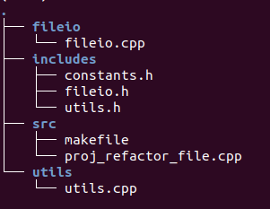
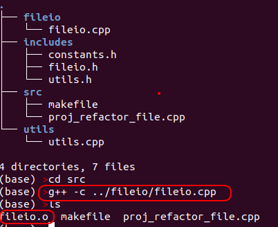

**Project 2**

Your task is to break apart a monolithic file into related modules in a
sensible directory structure. Please leave all functions as written
(that is unimplemented).

This project has several parts;

1.  Refactoring a monolithic cpp file into smaller modular files and
    directories

2.  Using #includes effectively

3.  Using relative paths

4.  Writing a makefile to accompany your newly modularized solution.

This project does NOT use eclipse.All you need is an editor (VSCode,
Sublime, micro, nano\...whatever you like) and the GNU toolchain.

**Refactoring a monolithic cpp file into smaller modular files and
directories**

You are given proj_refactor_file.cpp. In it there is a collection of
constants and functions. Please break this file up into the following
directory structure;

fileio.cpp: contains load and save function definitions and all
necessary includes

fileio.h: contains load and save function declarations and all necessary
includes

utils.cpp: contains sort, getNext, getSize and handleMissingData
function definitions and all necessary includes

utils.h: contains sort, getNext, getSize and handleMissingData function
declarations and all necessary includes

constants.h: contains all constants, the enum and the struct and all
necessary includes

proj_refactor_file.cpp: contains only main() and all necessary includes
after you move everything else

makefile: used to build and clean this project (see starter makefile)

**Using #includes effectively**

-   For all of the above files, use the minimum number of includes
    needed for the file to compile.

-   All .cpp files should #include their associated .h files.

-   Please include system includes before user includes

    -   *For instance sort in utils.h has a vector that\'s passed by
        reference. So you must include vector; like so;*

-   If a cpp or header file uses a function or constant declared or
    defined in another .h or .cpp file then it must #include the
    appropriate .h file.

    -   *For instance utils.h declares the function sort which uses
        SORT_ORDER. SORT_ORDER is defined in constants.h, so utils.h
        must include constants.h like so;*

-   [Please do not #include cpp files]{.ul}! This is an automatic 30 pt
    deduction

-   [Please use include guards in all .h files]{.ul}

**Using relative paths**

Please use relative paths in all includes and in the makefile. For
instance;

fileio.cpp must include fileio.h. So the following line should appear at
the top of fileio.cpp after any system includes;

This line includes fileio.h by going up 1 directory (..) then down into
the includes directory (/includes) and then selects fileio.h for
inclusion.

Please do this as needed.

**Writing a makefile to accompany your newly modularized solution.**

Please complete all TODOs in the skeleton makefile provided. Note GNU
make and g++ can process relative paths. For example from the source
directory of the completed project I can compile fileio.cpp to fileio.o
as shown below.

Relative paths work the same way in makefiles.

**Grading:**

*(50%) Correctly refactor monolithic file as annotated above*

*(20%) Correctly implement all TODO's in the provided makefile.*

*(20%)Push your solution to gitlab*

You should push 7 files to your repository; fileio.cpp,
constants.h,fileio.h, utils.h, makefile, proj_refactor_file.cpp and
utils.cpp

(10%) free

**I will test by;**

Cloning your repository

Running 'make' and verifying correct executable generated

running 'make clean' and verifying that all compile byproducts are
removed

Running combinations of your files and my files to verify correct
output. Note: I will probably change the values in constants.h when
testing your code.

**Potential Gotchas:**

Filenames are case sensitive, F.cpp is not the same as f.cpp
